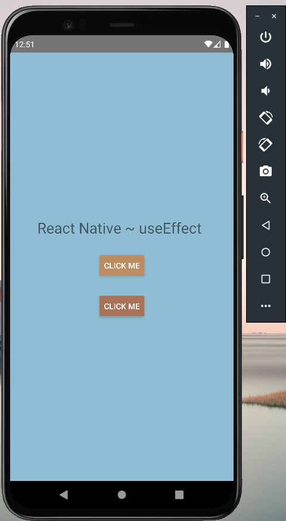

# myHooks
## This repository is about the use of Hooks in React Native. A sample app.

### Screenshots:

### ``` Main  ```
<div align="center">
  
  </div>

### ``` Terminal ```
<div align="center">
  
  </div>
